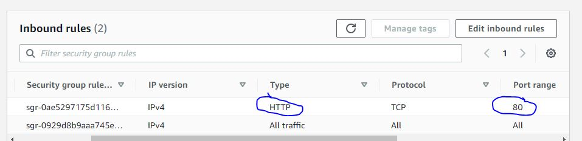
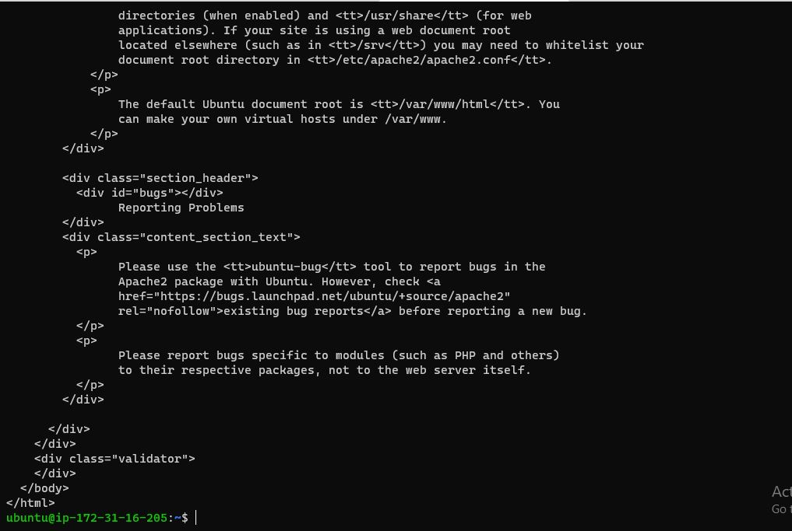
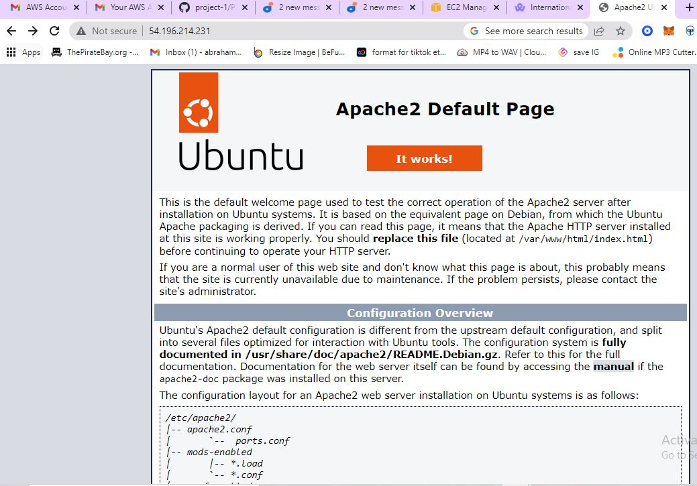
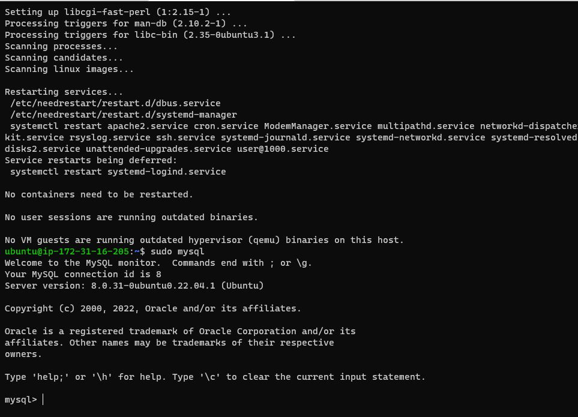
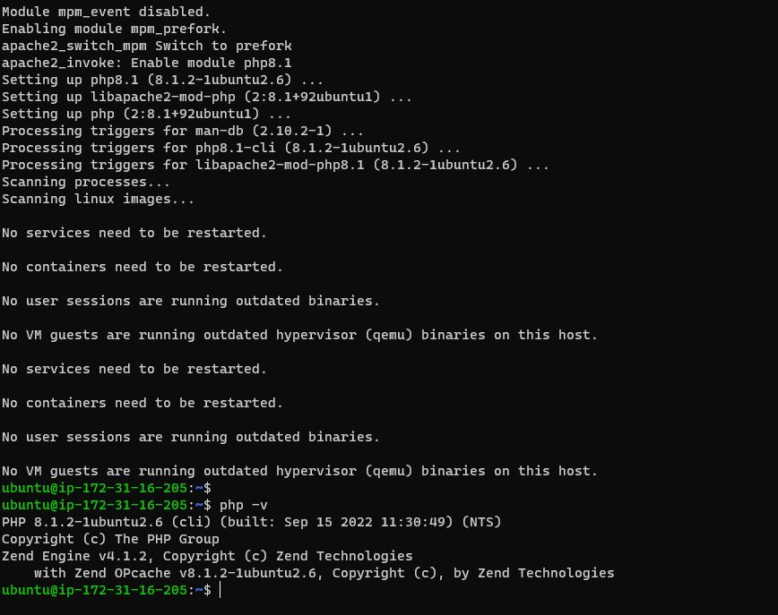
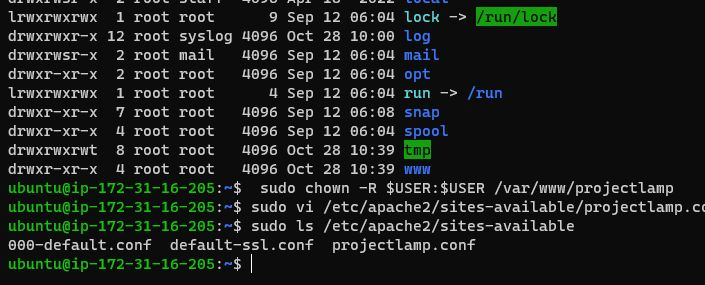

## Awesome Documentation of Project 1 of DevOps By Paladin 

`sudo apt update`

`sudo apt install apache2`

`sudo systemctl status apache2`

- [Install oppenssh](https://docs.microsoft.com/en-us/windows-server/administration/openssh/openssh_install_firstuse)

- [openssh-key management](https://docs.microsoft.com/en-us/windows-server/administration/openssh/openssh_keymanagement)

- [markdown cheat sheet](https://www.markdownguide.org/cheat-sheet/)

I add a rule to EC2 configuration to open inbound connection through port 80 just like in the image below

Accessing my server locally in Ubuntu shell I type this command

`curl http://localhost:80`

`http://<Public-IP-Address>:80`

`$ sudo mysql`

 type this command to check php version after installation `php -v`

 

 `sudo ls /etc/apache2/sites-available`

 

 

